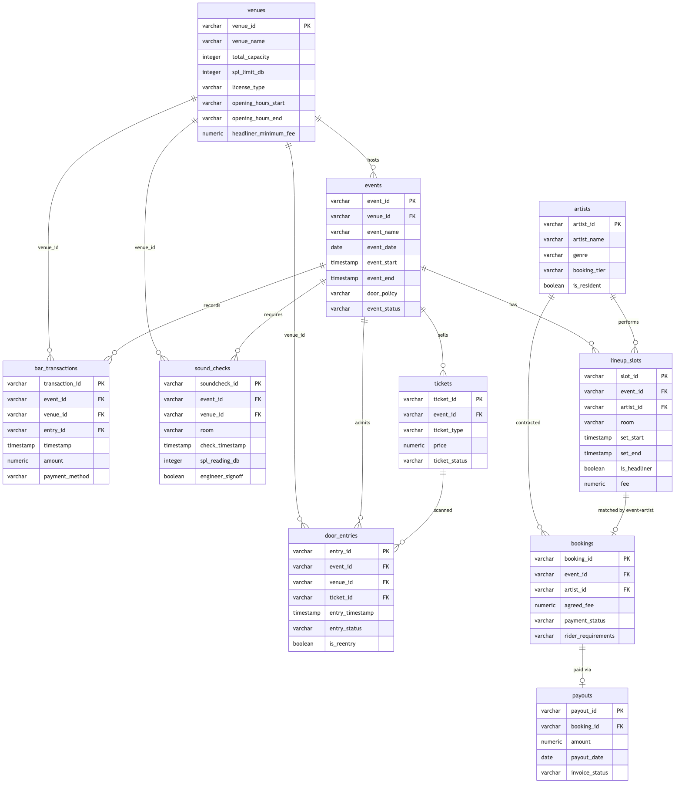

# nightlive

Nightlife platform managing clubs, events, DJs, ticket sales, door entry, bar transactions, artist bookings, and sound system logistics — inspired by the Berlin techno scene. Built with dbt on DuckDB. Designed as a test bench for the nightd agent.

## Quick Start

```bash
uv sync
uv run dbt seed
uv run dbt run
uv run dbt test
```

Or with [mise](https://mise.jdx.dev):

```bash
mise run build
```

The provided seeds contain NULL values that intentionally break the data tests. The nightd agent's task is to impute the correct values so that all tests pass.

## Project Structure

```
.
├── images/
├── models/
│   ├── staging/            # typed views over raw seeds (stg_*)
│   ├── serving/            # joined & aggregated mart tables (srv_*) with per-model .yml tests
│   └── sources.yml         # declares seed tables as dbt sources
├── seeds/                  # CSVs with NULLs that intentionally break data tests
├── tests/                  # 43 singular SQL tests encoding business rules
├── dbt_project.yml
├── mise.toml
├── profiles.yml
└── pyproject.toml
```

**Staging** models (`stg_*`) cast raw seed columns to proper types (varchar, timestamp, numeric, boolean). **Serving** models (`srv_*`) join and aggregate staging data into analytics-ready tables - event financials, nightly revenue, weekend summaries, artist ledgers, and enriched versions of each entity. Each serving model has a co-located `.yml` file defining integrity tests (unique, not_null, accepted_values, relationships).

## Data Model

### Entity Relationships



#### venues — Clubs and event spaces with capacity and licensing information

| Column | Type | Description |
|--------|------|-------------|
| venue_id | varchar | PK (V001-V005) |
| venue_name | varchar | Club name (Berghain, Tresor, ://about blank, Sisyphos, RSO.Berlin) |
| address | varchar | Street address |
| total_capacity | integer | Total venue capacity across all rooms |
| main_floor_capacity | integer | Main dance floor capacity |
| bar_area_capacity | integer | Bar area capacity |
| garden_capacity | integer | Outdoor garden area capacity |
| sound_system | varchar | Sound system brand/type |
| spl_limit_db | integer | Maximum allowed SPL in decibels per venue license |
| license_type | varchar | full_night, weekend |
| opening_hours_start | varchar | Typical opening time (e.g. "23:00") |
| opening_hours_end | varchar | Typical closing time (e.g. "20:00" next day) |
| headliner_minimum_fee | numeric | Minimum fee for headliner slots at this venue |

#### artists — DJs and live acts

| Column | Type | Description |
|--------|------|-------------|
| artist_id | varchar | PK (A001-A015) |
| artist_name | varchar | Stage name |
| genre | varchar | techno, house, minimal, industrial, electro |
| booking_tier | varchar | headliner, mid_tier, opener |
| is_resident | boolean | Whether artist is a venue resident |
| home_city | varchar | Artist's home city |

#### events — Parties and club nights (often cross midnight, can span 12-48h)

| Column | Type | Description |
|--------|------|-------------|
| event_id | varchar | PK (E001-E010) |
| venue_id | varchar | FK -> venues |
| event_name | varchar | Event/party name |
| event_date | date | Primary date of the event |
| event_start | timestamp | Event start (typically 22:00-02:00) |
| event_end | timestamp | Event end (can be next day or days later) |
| door_policy | varchar | strict, relaxed, members_only |
| event_status | varchar | draft, confirmed, live, completed |

#### lineup_slots — Artist-to-event set time assignments per room

| Column | Type | Description |
|--------|------|-------------|
| slot_id | varchar | PK |
| event_id | varchar | FK -> events |
| artist_id | varchar | FK -> artists |
| room | varchar | main_floor, bar_area, garden |
| set_start | timestamp | Set start time |
| set_end | timestamp | Set end time |
| is_headliner | boolean | Whether this is a headliner slot |
| fee | numeric | Artist fee for this slot |

#### tickets — Presale and at-door tickets

| Column | Type | Description |
|--------|------|-------------|
| ticket_id | varchar | PK |
| event_id | varchar | FK -> events |
| ticket_type | varchar | early_bird, regular, at_door |
| price | numeric | Ticket price |
| purchase_timestamp | timestamp | When the ticket was purchased |
| ticket_status | varchar | used, refunded, cancelled |

#### door_entries — Door scan and entry records, including re-entries (smoking breaks)

| Column | Type | Description |
|--------|------|-------------|
| entry_id | varchar | PK |
| event_id | varchar | FK -> events |
| venue_id | varchar | FK -> venues |
| ticket_id | varchar | FK -> tickets (nullable for guest list) |
| entry_timestamp | timestamp | Timestamp of door scan |
| entry_status | varchar | admitted, rejected |
| is_reentry | boolean | Whether this is a re-entry |

#### bar_transactions — POS bar/drink transactions

| Column | Type | Description |
|--------|------|-------------|
| transaction_id | varchar | PK |
| event_id | varchar | FK -> events |
| venue_id | varchar | FK -> venues |
| entry_id | varchar | FK -> door_entries (nullable) |
| timestamp | timestamp | Transaction time |
| item_category | varchar | Item category (drinks) |
| amount | numeric | Transaction amount |
| payment_method | varchar | card, cash |
| tab_ref | varchar | Tab reference (nullable, for running tabs) |

#### bookings — Artist booking contracts

| Column | Type | Description |
|--------|------|-------------|
| booking_id | varchar | PK |
| event_id | varchar | FK -> events |
| artist_id | varchar | FK -> artists |
| agreed_fee | numeric | Contracted performance fee |
| payment_status | varchar | pending, confirmed, paid, cancelled |
| rider_requirements | varchar | basic_rider, standard_rider, premium_rider |
| cancellation_terms | varchar | Cancellation notice period |

#### sound_checks — Pre-event sound system checks per room

| Column | Type | Description |
|--------|------|-------------|
| soundcheck_id | varchar | PK |
| event_id | varchar | FK -> events |
| venue_id | varchar | FK -> venues |
| room | varchar | Room checked |
| check_timestamp | timestamp | When the check was performed |
| spl_reading_db | integer | Measured SPL in decibels |
| equipment_list | varchar | Pipe-delimited equipment list |
| engineer_signoff | boolean | Whether sound engineer signed off |

#### payouts — Artist payment records

| Column | Type | Description |
|--------|------|-------------|
| payout_id | varchar | PK |
| booking_id | varchar | FK -> bookings |
| amount | numeric | Payout amount |
| payout_date | date | When payout was processed |
| invoice_status | varchar | pending, settled |

## Business Rules

These rules are enforced by 43 singular SQL tests and 49 schema tests (unique, not_null, accepted_values, relationships):

1. **Event timing** — Events typically start between 22:00-02:00 and end between 06:00-Monday afternoon. Berghain Klubnacht runs Friday midnight through Sunday evening. Event start must be at or after venue opening time and at or before the first door entry. Event end must cover all lineup sets and not exceed venue closing time.
2. **Door policy** — Berghain has "strict" door policy; most other venues are "relaxed" or "members_only".
3. **Re-entries** — Common for smoking breaks. A re-entry requires a prior admission for the same ticket. Re-entry counts towards running occupancy.
4. **Headliner minimums** — Each venue has a minimum fee for headliner slots. Headliners must never be paid below this threshold.
5. **Artist exclusivity** — Artists cannot be double-booked at overlapping times across different venues.
6. **Room scheduling** — No two artists in the same room at the same time. Set end must be after set start. Openers cannot be marked as headliners.
7. **Sound compliance** — SPL readings must not exceed the venue's licensed limit. Every active room must have a sound check before the event starts.
8. **Financial integrity** — Lineup fees must match booking fees per artist. Booking fees must balance against lineup fees per event. Payout amounts must match booking fees. Paid bookings must have payouts; confirmed bookings must not. No payouts before the event date.
9. **Operational windows** — Door entries and bar transactions must occur during event hours. Bar sales require a prior admitted entry. Tickets cannot be refunded after door entry. No duplicate ticket scans.
10. **Referential consistency** — Venue IDs in door entries, bar transactions, and sound checks must match the event's venue. Ticket event IDs must match door entry event IDs. All event references across tables must point to existing events.
